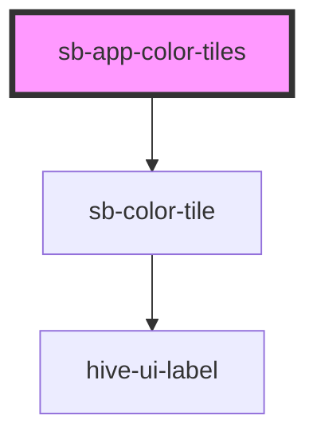

# sb-app-color-tiles

<!-- Auto Generated Below -->

## Properties

| Property  | Attribute | Description                                                                                                                                  | Type     | Default     |
| --------- | --------- | -------------------------------------------------------------------------------------------------------------------------------------------- | -------- | ----------- |
| `pattern` | `pattern` | The pattern to filter the matched CSS variables by. Used to target only the names of the CSS variables available from your projects/lib/app. | `string` | `undefined` |

## Dependencies

### Depends on

- [sb-color-tile](../color-tile)

### Graph

----------------------------------------------

*Built with [StencilJS](https://stenciljs.com/)*
