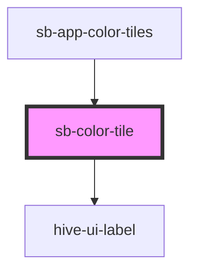

# hive-ui-color-tile

<!-- Auto Generated Below -->

## Properties

| Property     | Attribute     | Description                                                                      | Type      | Default     |
| ------------ | ------------- | -------------------------------------------------------------------------------- | --------- | ----------- |
| `cmyk`       | `cmyk`        | The cmyk value to render.                                                        | `string`  | `undefined` |
| `hex`        | `hex`         | The hex value to render.                                                         | `string`  | `undefined` |
| `hsl`        | `hsl`         | The hsl value to render.                                                         | `string`  | `undefined` |
| `nameDetect` | `name-detect` | `true` if the color tile should attempt to detect the name from an external API. | `boolean` | `true`      |
| `rgb`        | `rgb`         | The rgb value to render.                                                         | `string`  | `undefined` |
| `variable`   | `variable`    | The CSS variable to attempt to render.                                           | `string`  | `undefined` |

## Dependencies

### Used by

 - [sb-app-color-tiles](../app-color-tiles)

### Depends on

- [hive-ui-label](../label)

### Graph

----------------------------------------------

*Built with [StencilJS](https://stenciljs.com/)*
