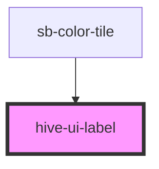

# hive-ui-label

<!-- Auto Generated Below -->

## Properties

| Property      | Attribute      | Description                                                                                                           | Type                                                                      | Default     |
| ------------- | -------------- | --------------------------------------------------------------------------------------------------------------------- | ------------------------------------------------------------------------- | ----------- |
| `alignCenter` | `align-center` |                                                                                                                       | `boolean`                                                                 | `undefined` |
| `alignLeft`   | `align-left`   |                                                                                                                       | `boolean`                                                                 | `undefined` |
| `alignRight`  | `align-right`  |                                                                                                                       | `boolean`                                                                 | `undefined` |
| `base`        | `base`         |                                                                                                                       | `boolean`                                                                 | `undefined` |
| `bold`        | `bold`         |                                                                                                                       | `boolean`                                                                 | `undefined` |
| `book`        | `book`         |                                                                                                                       | `boolean`                                                                 | `undefined` |
| `capitalize`  | `capitalize`   |                                                                                                                       | `boolean`                                                                 | `undefined` |
| `color`       | `color`        | The primary color of the label. Uses the branded CSS variables that are globally available to the application.        | `"black" \| "danger" \| "primary" \| "secondary" \| "success" \| "white"` | `undefined` |
| `heading`     | `heading`      |                                                                                                                       | `boolean`                                                                 | `undefined` |
| `lg`          | `lg`           |                                                                                                                       | `boolean`                                                                 | `undefined` |
| `lowercase`   | `lowercase`    |                                                                                                                       | `boolean`                                                                 | `undefined` |
| `maxLines`    | `max-lines`    | The maximum lines to display before truncating the text. Default behavior shows all lines of text with no truncation. | `number`                                                                  | `undefined` |
| `medium`      | `medium`       |                                                                                                                       | `boolean`                                                                 | `undefined` |
| `semibold`    | `semibold`     |                                                                                                                       | `boolean`                                                                 | `undefined` |
| `sm`          | `sm`           |                                                                                                                       | `boolean`                                                                 | `undefined` |
| `uppercase`   | `uppercase`    |                                                                                                                       | `boolean`                                                                 | `undefined` |
| `xbold`       | `xbold`        |                                                                                                                       | `boolean`                                                                 | `undefined` |
| `xl`          | `xl`           |                                                                                                                       | `boolean`                                                                 | `undefined` |
| `xs`          | `xs`           |                                                                                                                       | `boolean`                                                                 | `undefined` |
| `xxl`         | `xxl`          |                                                                                                                       | `boolean`                                                                 | `undefined` |
| `xxs`         | `xxs`          |                                                                                                                       | `boolean`                                                                 | `undefined` |

## Dependencies

### Used by

 - [sb-color-tile](../color-tile)

### Graph

----------------------------------------------

*Built with [StencilJS](https://stenciljs.com/)*
